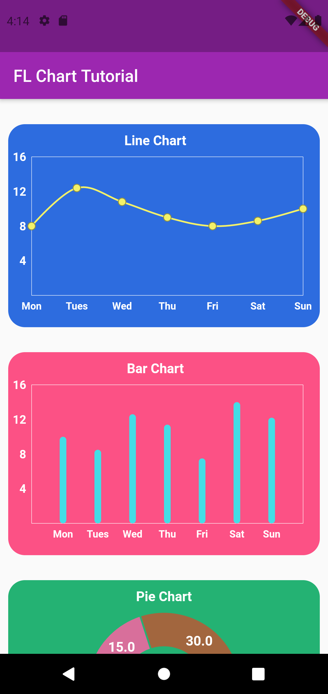

# Flutter - Creating Simple Chart Using Fl Chart

Creating beautiful chart using FL Chart Package

### App Preview

### Tutorial Series
A few resources to get you started to create chart on flutter :

- Line Chart : [Creating Simple Line Chart](https://dev.to/redhunter7/flutter-create-simple-line-chart-1h5n)
- Bar Chart : [Creating Simple Bar Chart](https://dev.to/redhunter7/flutter-create-simple-bar-chart-8gl)
- Bar Chart : [Creating Simple Pie Chart](https://dev.to/redhunter7/flutter-create-simple-pie-chart-15lj)

For more detail about Fl Chart Package , view this
[FL Chart Documentaion](https://pub.dev/packages/fl_chart), which offers samples and full API reference.